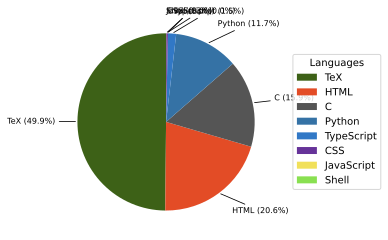

# 千葉工業大学 高度技術者育成プログラム GARDENs

千葉工業大学津田沼キャンパスにて超小型衛星の製作を行っています。

---

## Organization Activity
<!-- ORG-STATS:START -->
最終更新: 2026-02-28T18:17:57Z

- リポジトリ総数: **9**
- 直近30日で更新があったリポジトリ: **3**

### 📦 最近動いたリポジトリ
| Repo | Pushed | Stars | Lang |
|------|--------|-------|------|
| [.github](https://github.com/CIT-GARDENs-Organization/.github) | 2026-02-27 | ⭐ 0 | Python |
| [MMJ_SW_053_CIGS_PIC](https://github.com/CIT-GARDENs-Organization/MMJ_SW_053_CIGS_PIC) | 2026-02-27 | ⭐ 0 | C |
| [MMJ_SW_412_MMJ_ANT_Analize](https://github.com/CIT-GARDENs-Organization/MMJ_SW_412_MMJ_ANT_Analize) | 2026-01-31 | ⭐ 0 | - |
| [next-pass-viewer-public](https://github.com/CIT-GARDENs-Organization/next-pass-viewer-public) | 2025-12-04 | ⭐ 1 | TypeScript |
| [MIS_MCU_python](https://github.com/CIT-GARDENs-Organization/MIS_MCU_python) | 2025-10-28 | ⭐ 0 | Python |
| [BOSS_PIC_simulator](https://github.com/CIT-GARDENs-Organization/BOSS_PIC_simulator) | 2025-10-15 | ⭐ 1 | Python |
| [MIS_MCU_CCSC](https://github.com/CIT-GARDENs-Organization/MIS_MCU_CCSC) | 2025-09-10 | ⭐ 0 | C |
| [cigs-packet-analyzer](https://github.com/CIT-GARDENs-Organization/cigs-packet-analyzer) | 2025-08-31 | ⭐ 0 | Python |
| [MeasurementReceiverSensitivity_Receiveside](https://github.com/CIT-GARDENs-Organization/MeasurementReceiverSensitivity_Receiveside) | 2025-03-12 | ⭐ 0 | Python |

### 🗣️ Language Summary (org-wide)
| Language | Bytes | Ratio |
|----------|-------|-------|
| TeX | 1303115 | 49.9% |
| HTML | 538954 | 20.7% |
| C | 412642 | 15.8% |
| Python | 306944 | 11.8% |
| TypeScript | 38995 | 1.5% |
| CSS | 8192 | 0.3% |
| JavaScript | 528 | 0.0% |

※ グラフ版は `../assets/langs.svg` を参照

### 🧑‍💻 Top Contributors (all repos)
| User | Contributions |
|------|----------------|
| @takebmb | 144 |
| @rhoggs-bot-test-account | 123 |
| @s21a2018 | 57 |
| @mkyt0230 | 13 |
| @Kubuny | 11 |
| @waarrk | 2 |
| @tairokataoka | 1 |

### 🛰️ Satellite Projects
#### MOMIJI
- [MMJ_SW_053_CIGS_PIC](https://github.com/CIT-GARDENs-Organization/MMJ_SW_053_CIGS_PIC)
- [MMJ_SW_412_MMJ_ANT_Analize](https://github.com/CIT-GARDENs-Organization/MMJ_SW_412_MMJ_ANT_Analize)

#### OTHERS
- [.github](https://github.com/CIT-GARDENs-Organization/.github)
- [BOSS_PIC_simulator](https://github.com/CIT-GARDENs-Organization/BOSS_PIC_simulator)
- [cigs-packet-analyzer](https://github.com/CIT-GARDENs-Organization/cigs-packet-analyzer)
- [MeasurementReceiverSensitivity_Receiveside](https://github.com/CIT-GARDENs-Organization/MeasurementReceiverSensitivity_Receiveside)
- [MIS_MCU_CCSC](https://github.com/CIT-GARDENs-Organization/MIS_MCU_CCSC)
- [MIS_MCU_python](https://github.com/CIT-GARDENs-Organization/MIS_MCU_python)
- [next-pass-viewer-public](https://github.com/CIT-GARDENs-Organization/next-pass-viewer-public)

<!-- ORG-STATS:END -->

---

## Language Mix (auto)
上のスクリプトで生成されたSVGを表示します。

